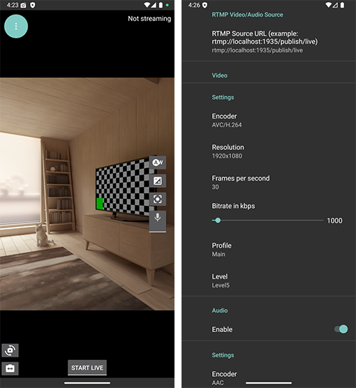

# LifeStreamer Android app

Live streaming app for Android designed for IRL streaming based on [StreamPack SDK](https://github.com/ThibaultBee/StreamPack).

## Features

- Publish streams over SRT with dynamic/adaptive bitrate algorithm from [Belabox](https://belabox.net/) or [Moblin](https://github.com/eerimoq/moblin).
- RTMP as video/audio source - restream RTMP feed from action cameras as SRT HEVC with great dynamic bitrate.
- A lot of features come from StreamPack by default, check the list [here](https://github.com/ThibaultBee/StreamPack?tab=readme-ov-file#features).

Discord server: https://discord.gg/2UzEkU2AJW

## Apps that can work together

- [MediaSrvr](https://github.com/dimadesu/MediaSrvr) - Runs RTMP server on Android phone. You can publish RTMP stream to it from an action camera, for example.
- LifeStreamer - Can use RTMP as source: playback RTMP stream from server and restream it as SRT with great dynamic bitrate.
- [Bond Bunny](https://github.com/dimadesu/bond-bunny) - You can use LifeStreamer to publish SRT stream into Bond Bunny app. Bond Bunny accepts SRT as input and forwards packets to SRTLA server like Belabox Cloud. Uses multiple networks to improve stream quality.

## How to install

For now, I'll be releasing APK files using [GitHub releases](https://github.com/dimadesu/LifeStreamer/releases).

Open [GitHub releases page](https://github.com/dimadesu/LifeStreamer/releases) on your phone, download APK and install.

## My goals

My original motiviation for this project was to improve live streaming for action cameras like DJI Osmo Action 4 or GoPro.
As of now (September 2025) they can only stream RTMP which usually diconnects a lot on unstable internet.
I want to restream RTMP as SRT HEVC with great dynamic bitrate algorithm. That should fix it.

I am building an app for myself that other people can use too. I'll be focusing on main core functionality, not gimmicky features.

Top priorities:
- Great dynamic aka adaptive bitrate algorithm.
- Foreground service / background mode.
- RTMP as video/audio source.

Stretch goal: USB/UVC as video/audio source.

## Roadmap

I've started with original camera demo from StreamPack. I'm tweaking it and adding new features on top of it.

### Main implemented features

- [x] Dynamic/adaptive bitrate. I added [Belabox](https://github.com/BELABOX/belacoder) and [Moblin](https://github.com/eerimoq/moblin) algorithms. Can be changed via Settings.
- [x] Background mode (foreground service) to allow streaming with app in background, phone locked and screen off.
  - Status: Usable, needs performance improvements.
- [x] RTMP as source.
  - Status: Usable.
  - Run RTMP server on your device using [MediaSrvr](https://github.com/dimadesu/MediaSrvr) app.
    - Alternatively, run [MediaMTX](https://github.com/bluenviron/mediamtx) in [Termux](https://termux.dev/en/). [Watch video to see how to set it up.](https://youtu.be/5H0AZca3nk4?si=yaAxqQ5-FW5GnKpq&t=310)
  - Stream RTMP from action camera to RTMP server.
  - Give LifeStreamer RTMP URL to that server to play and it will use it as video/audio source.
  - There are many things that can go wrong with RTMP source, but I got the basic version working.

### Planning to implement next

- Re-connect on disconnect
- Polish existing functionality and user flows

## Why StreamPack

Main features StreamPack provides out of the box that make sense to have as a base for this project:

- Ability to stream via SRT or RTMP.
- H.265 (aka HEVC) or H.264.
- Basic dynamic bitrate algorithm for SRT (it calls it "bitrate regulator").
- Foundation for implementing service to allow continue streaming in background with phone locked and screen off.
- It's designed to be extensible with custom video and audio sources.

### Demo apps

StreamPack includes 2 great demo apps that can use phone cameras or screen recorder for live streaming.

## Project status update 15 October 2025

Applies to [LifeStreamer v0.3.3](https://github.com/dimadesu/LifeStreamer/releases/tag/v0.3.3).

- :white_check_mark: Dynamic bitrate

  - 3 algorithms added: Belabox, Moblin fast, Moblin slow. All seems to work well. Still testing.
  - Algortihm can be configured in Settings.
  - When "bitrate regulation" is enabled the only bitrate setting that is used is maximum bitrate under "bitrate regulation".

- :white_check_mark: RTMP as source

  It was stabilised a lot in the recent versions:

    - You can switch inputs to/from RTMP source with confidence - doesn't glitch out.
    - UI was updated to explain what it is going on with RTMP stream.
    - If you stop/start RTMP source stream LifeStreamer should handle it w/o issues.
    - Retries for playing RTMP stream.
    - Etc.
  
  I recommened monitoring the stream on the 2nd phone. Do not use streaming phone for anything else as much as possible, keep LifeStreamer app open (in foreground) for best performance.

  What works:

  - Start RTMP server.
  - Start action cam stream to RTMP server.
  - Kill LifeStreamer app/service.
  - Start LifeStreamer app.
  - Switch to RTMP source.
  - Start the stream from LifeStreamer.
  - Notes:
    - If you use Bond Bunny make sure to use version like [v1.0.5](https://github.com/dimadesu/bond-bunny/releases/tag/v1.0.5) it had some important updates to work better.
    - Works on my Samsung S20 FE on a usable cell signal (assuming phone is not too hot, so no CPU throttling).

- :warning: Background mode

  It already works well if you don't get greedy and push video settings too far.

  Phone has a lot less CPU and other resources available to apps in the background.
  Either lower your video endcoder settings if you want to use other apps on your phone while streaming OR avoid using other apps to not compete for resources.

  Looks like there is no magic fix, just a bunch of performance tweaks needed.

  Example. My phone is Samsung S20 FE. I stream full HD 30fps.

  - If I don't use phone/apps: it works w/o issues with 6000 kbps, I wouldn't set it higher.
  - If I want to use maps, browser, etc. during the stream: ~2000-3000 kbps max seems to work without major glitches.
  
  Can be a bit unstable and stuttery otherwise. **Workarounds:**

  - Stay in the foreground as much as possible.
  - Don't go into background at all.

## Recommended solutions to most issues

**There are bugs. General workaround for all of them: kill LifeStreamer app/service and start fresh. Sometimes something in settings glitches out - wipe app data or reinstall.**

Minimise transitions between foreground/background and stay in foreground for better performance with screen on and phone unlocked until background mode is fixed.

Once you find configuration that works get a solid sample size of that and then start carefully adding/changing things and test if it still works as expected.

Some settings can be changed on the fly. It's best to kill app/service and restart the app after changing settings - this seems to help.

Goal for near future is stabilising as much as possible and making sure it's solid. It will take some time to polish.

MVP sort of works. Use recommended workarounds if you encounter issues.
