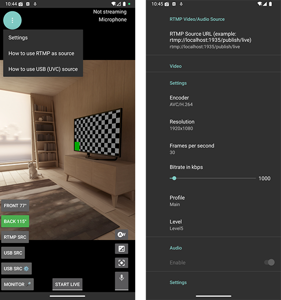
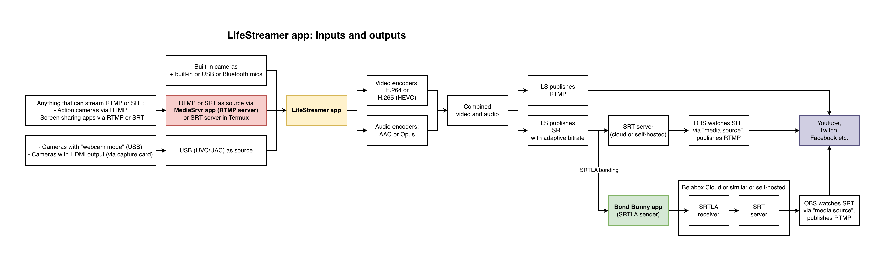

# LifeStreamer - Android app for IRL live streaming

LifeStreamer is an Android app designed for IRL live streaming based on [StreamPack SDK](https://github.com/ThibaultBee/StreamPack).

## Features

- Restream RTMP feed or USB video/audio (UVC) from action camera like DJI Osmo Action 4 as SRT HEVC/H.265 with amazing dynamic/adaptive bitrate algorithm from [Belabox](https://belabox.net/) or [Moblin](https://github.com/eerimoq/moblin).
- SRTLA connection bonding. Combine internet from multiple networks or SIM cards to improve resilience. Alternatively, use SRTLA bonding via [Bond Bunny](https://github.com/dimadesu/bond-bunny) app.
- Moblink streamer server. Use additional phones as bonding connections using [Moblink](https://github.com/eerimoq/moblink) relay app.
- Can use feed from any RTMP or SRT server as source. For Android I built [MediaSrvr](https://github.com/dimadesu/MediaSrvr) app that can run RTMP server on Android devices.
- USB as source. Works with DJI Osmo Action 4 in 'Webcam' mode when connected to phone with one USB-C to USB-C cable. Also can work with Elgato Cam Link even when connected via USB hub. Feel free to test other UVC devices, like capture cards. I will mostly target DJI OA4 and Cam Link for now. Note: Phones can lower USB audio quality when USB video is used.
- Background mode (foreground service) allows streaming with app in background, phone locked and screen off. Phone limits access to resources in this mode, so performance can be worse. Test first and consider lowering video encoder settings and bitrate. Note: Performance has improved significantly since switching from "debug" to "release" builds.
- Aggressive infinite reconnect when app loses connection.
- Audio monitoring for all audio sources.
- Switch between all video and audio sources while streaming.
- A lot of features come from StreamPack by default, check the list [here](https://github.com/ThibaultBee/StreamPack?tab=readme-ov-file#features).

Share ideas or report issues in Discord https://discord.gg/2UzEkU2AJW or create Git issues.

## Sources

### Video

- Android device cameras.
- RTMP video. [Watch RTMP source demo.](https://www.youtube.com/watch?v=_zlWsQYxrE4)
- SRT video.
- USB video (UVC). [Watch USB source demo.](https://www.youtube.com/watch?v=RlPWbekqPx4)

### Audio

- Android device microphones.
- USB audio: USB headphones, USB audio interfaces, wireless mic receivers, etc.
  - With USB video LifeStreamer is using USB audio from USB camera if available.
- Mics from Bluetooth headphones, earbuds, etc.
- For RTMP and SRT sources app uses Media Projection Audio to record RTMP/SRT player audio - kind of like phone screen recorder.
- Record device's audio output (system audio).

## Apps that can work together

See the [demo video on YouTube](https://www.youtube.com/watch?v=_zlWsQYxrE4).

- [MediaSrvr](https://github.com/dimadesu/MediaSrvr) - Runs RTMP server on Android phone. You can publish RTMP stream to it from an action camera, for example.
- LifeStreamer - Can use RTMP as source: playback RTMP stream from server and restream it as SRT with great dynamic bitrate.
- [Bond Bunny](https://github.com/dimadesu/bond-bunny) - You can use LifeStreamer to publish SRT stream into Bond Bunny app. Bond Bunny accepts SRT as input and forwards packets to SRTLA server like Belabox Cloud. Uses multiple networks to improve stream quality.
- [DJI Remote](https://github.com/dimadesu/dji-remote) - Remote control DJI cameras via Bluetooth. Configure and start RTMP livestream faster than official DJI Mimo app.

## How to install

### Google Play Store

You can install app from Google Play Store. Follow [this link](https://play.google.com/store/apps/details?id=com.dimadesu.lifestreamer).

### GitHub releases

I was originally releasing .apk files using [GitHub releases](https://github.com/dimadesu/LifeStreamer/releases). I plan to continue releasing on GitHub as a backup.

Open [GitHub releases page](https://github.com/dimadesu/LifeStreamer/releases) on your phone, download .apk file and install.

#### ⚠️ Note on GitHub VS. Google Play Store releases

GitHub and Play Store releases are signed with different keys, which means they are incompatible with one another. You have to delete one version to install the other.

## My goals

My original motiviation for this project was to improve live streaming for action cameras like DJI Osmo Action 4 or GoPro.
As of now (September 2025) they can only stream RTMP which usually diconnects a lot on unstable internet.
I want to restream RTMP as SRT HEVC with great dynamic bitrate algorithm. That should fix it.

## Why StreamPack

Main features StreamPack provides out of the box that make sense to have as a base for this project:

- Ability to stream via SRT or RTMP.
- H.265 (aka HEVC) or H.264.
- Basic dynamic bitrate algorithm for SRT (it calls it "bitrate regulator").
- Foundation for implementing service to allow continue streaming in background with phone locked and screen off.
- It's designed to be extendable with custom video and audio sources.

### Demo apps

StreamPack includes 2 great demo apps that can use phone cameras or screen recorder for live streaming.

## Recommended solutions to most issues

**General workaround for issues: kill LifeStreamer app/service and start fresh. Sometimes something in settings glitches out - wipe app data or reinstall.**

**Settings can be changed during the stream, but won't apply until you restart the stream.**

**Note: Max/target bitrate under bitrate regulation in settings can be changed on the fly during the stream - no need to restart the stream to apply.**

Use recommended workarounds if you encounter issues.

## Apps that can stream SRT on Android

- IRL Pro (free)
- Larix Broadcaster (subscription)
- Larix Screencaster (subscription)
- Can do HDMI/USB/UVC as input:
  - USB Camera (free with ads) / USB Camera Pro (one-time payment to remove ads)
  - CameraFi (free version with ads or subscription)

## Similar/related projects

- [IRL Pro](https://irlpro.app/)
- [BELABOX](https://belabox.net/)
- [Moblin](https://github.com/eerimoq/moblin)
- [Moblink](https://github.com/eerimoq/moblink)

## FAQ

### Chat?

There are existing chat apps for Android like [Stream Buddy](https://play.google.com/store/apps/details?id=com.streamomation.streamerchat). I suggest you do side-by-side view with LifeStramer and chat app if your phone has this feature or use 2nd phone for chat.

### Overlays?

I highly recommend adding overlays in OBS that restreams SRT.
